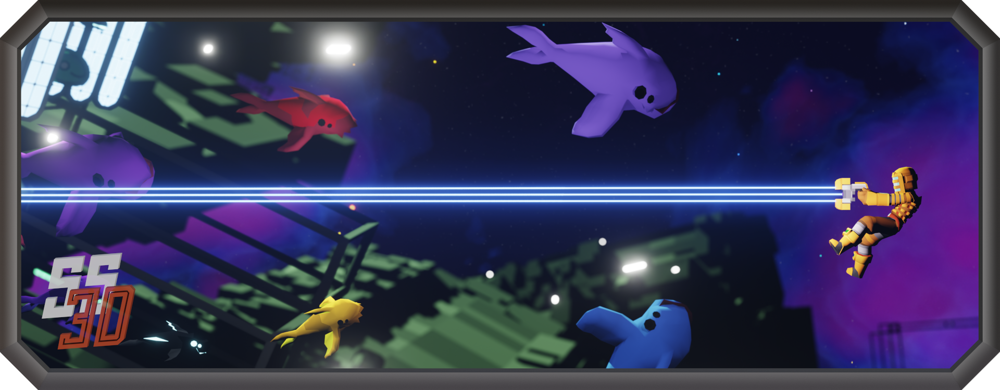

<h3 align="center">Art repository for <a href="https://ss3d.space/">Space Station 3D</a>!</h3>

 

## INFO 

This repository is for holding all SS3D art assets (art assets are assets created by our contributors externally from our game engine, Unity).

Most of the time we save the assets' source file (.blend for example) in this repository, but sometimes exported files will be here if no source file exists or is needed.

Prior to using GitHub, our art assets were submitted manually, and thus we have been keeping a list of the contributors [here](https://docs.google.com/spreadsheets/d/1p5mEuqPZIFV5oGwKxdZSqUzp9qHCuANz) and will continue doing so until all the assets have been moved to GitHub.

*We plan to integrate/nest this repo into our game repo in the future to make asset contributing more streamline than it currently is.*

 

## CONTRIBUTING

We now have a proper [art guide](https://ss3d.gitbook.io/art-guide/), with guides and links to tasks boards based on asset types.

More art tasks will be moved to GitHub as we progress forward, thanks for being patient.

 

## LICENSE

ALL asset & artwork files fall under **[CC BY-NC-SA 4.0](Documents/LICENSE-ASSETS.md)**
