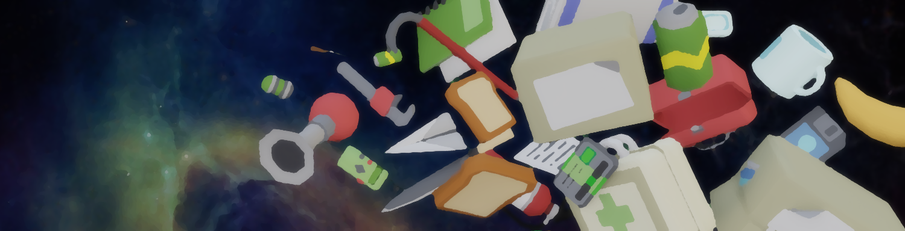

# SS3D Art

<h5 align="center">Art repository for Space Station 3D.</h5>

## CONTRIBUTING

This repository is for holding all SS3D art assets (assets created outside of our game engine, Unity).

Most of the time it will be the assets' source file (.blend, etc.) in this repository, but sometimes exported files can be saved here if no source file exists for them.

### Task Boards

- [Models](https://trello.com/b/ZVcDitv0/ss3d-models)
- [Rigged Models](https://trello.com/b/cyDuUYyv/ss3d-rig-models)
- [3D Animations](https://trello.com/b/xZ5bhNWw/ss3d-animations)
- [2D Textures/Graphics](https://trello.com/b/XVZ95Hjq/ss3d-2d)
- [SFX](https://trello.com/b/k6pWgJE0/ss3d-sfx)
- [VFX](https://trello.com/b/uwo7b3cr/ss3d-vfx)

### Contributor Kits

- [Modeler's Kit v2.0](https://drive.google.com/drive/folders/11SMsOzh78-vNTq3Az5c-mUFpFw-5EOb8)(Blender 2.8 or newer only)

- [Character Animation Kit v3.0](https://drive.google.com/drive/u/1/folders/1gAqPkdEb6VeVT-oSx_rtvCh1x4EB0d4i)(Maya only)

- 2D Kit (COMING SOON)

### Guides

- [Using GitHub](https://ss3d.gitbook.io/programming/introduction/contributing-to-ss3d/github)

- [File Organization](https://ss3d.gitbook.io/programming/guidelines/file-naming-and-organization)

- [Art Asset Criteria](https://ss3d.gitbook.io/programming/guidelines/asset-criteria/art-assets-external)

## LICENSE

**[CC BY-NC-SA 4.0](Documents/LICENSE-ASSETS.md)**

