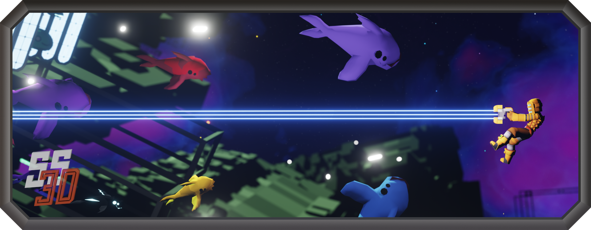

<h3 align="center">Art repository for <a href="https://ss3d.space/">Space Station 3D</a>!</h3>

 

## INFO 

This repository is for holding all SS3D art assets (assets created by our contributors externally from our game engine, Unity).

Most of the time it will be the assets' source file (.blend, etc.) in this repository, but sometimes exported files can be saved here if no source file exists or is needed for them.

Prior to using GitHub, our art assets were submitted manually, and thus we have been keeping a list of the contributors [here](https://docs.google.com/spreadsheets/d/1p5mEuqPZIFV5oGwKxdZSqUzp9qHCuANz) and will continue doing so until all the assets have been moved to GitHub.

 

## CONTRIBUTING

We now have a primary [art guide](https://ss3d.gitbook.io/art-guide/), with links to basics on contributors, tasks boards for different asset types, and guides for 2D & 3D assets.

More tasks will be moved to GitHub as we progress forward.

 

## LICENSE

ALL asset files fall under **[CC BY-NC-SA 4.0](Documents/LICENSE.md)**
